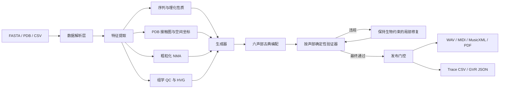

# BioSound GVR：可追溯的生物数据音乐转换平台

BioSound GVR 是一个本地运行的 Streamlit 平台。它把直接粘贴的 DNA/RNA/蛋白质文本、FASTA 序列、PDB 结构或 CSV 多组学表转换为可同时发声的六声部古典室内乐，并导出多轨 MIDI、多 Part MusicXML、MuseScore PDF、逐音符溯源表和 GVR 检查报告。

本项目吸收 `2607.11334v2.pdf` 的 Generate–Verify–Repair 思路，但不复刻论文昂贵的在线 LLM 实验。首版采用可复现的规则生成器，确定性验证器负责检查实际音乐事件，而不是相信生成器的文字声明。

完整功能、综述方法矩阵、算法公式、操作步骤、六声部配器、GVR 规则、输出字段和科研边界见 `BioSound_GVR可逆十二音列版平台功能与原理说明.docx`。平台生成结果后也可在“试听与导出”页直接下载该手册。

## 一分钟启动

双击 `启动平台.bat`。第一次运行会在本目录创建 `.venv` 并安装 Streamlit，随后浏览器会打开本地页面。平台以 headless 本地模式启动并关闭统计收集，不会询问邮箱、注册或登录；数据只在本机处理。

也可以在 PowerShell 中运行：

```powershell
cd "C:\Users\34591\Desktop\音乐基因转化\音乐工具开发"
python -m venv --system-site-packages .venv
.\.venv\Scripts\python.exe -m pip install -r requirements.txt
.\.venv\Scripts\python.exe -m streamlit run app.py
```

## 软件架构



目录职责：

- `biomusic/parsers.py`：FASTA、PDB 和 CSV 解析。
- `biomusic/features.py`：疏水性、电荷、质量、PDB 接触度、声像和粗粒化 NMA。
- `biomusic/codec.py`：DNA/RNA 四进制、蛋白质 21 进制分块与康托排名/逆排名、严格解码。
- `biomusic/mapping.py`：音高、节奏、音色、空间位置与十二音列生成。
- `biomusic/gvr.py`：验证、局部修复、最终发布检查。
- `biomusic/synth.py`：立体声 WAV 合成与 QC 低通滤波。
- `biomusic/exporters.py`：MIDI、MusicXML、MuseScore PDF 和 JSON 导出。
- `biomusic/pipeline.py`：把上述模块串成稳定 API。
- `app.py`：中文交互界面。

## 三类输入如何变成音乐

### FASTA

- 序列位置 → 时间顺序。
- 氨基酸身份 → `config/pitch_mapping.csv` 中的文献映射，或由理化特征映射至所选调式。
- 疏水性 → 主旋律时值、内声部音区与和声色彩；蛋白质前景由双簧管持续承担。
- 电荷 → 音区与力度。
- DNA/RNA 的碱基身份 → 调式级数；GC 状态 → 音区。

原始 Spinning Melodies 表中没有出现的 C、I、N、W 已以 `extended_inference` 明确标注，避免把推断伪装成文献事实。

### PDB

- CA 原子 x 坐标 → 左右声像。
- 8 Å 内残基接触数 → 音区张力与竖琴结构峰标记。
- PDB 的 HELIX/SHEET 记录 → 音符时值；未注释部分视为 coil。
- CA 坐标的单位弹簧各向异性网络模型 → 相对简正模态。

NMA 只保持本征模式间的对数比例，再映射到 55–1760 Hz。因为没有力常数与质量标定，它不是蛋白质绝对振动频率的测量。

### CSV

平台先依据列名识别序列、质谱、GWAS/EWAS 类关联景观、表观轨迹、代谢丰度或表达矩阵；只有无法识别时才把数值矩阵启发式解释为“行为细胞、列为基因”：

- `MT-`/`MT_` 开头的列 → 线粒体比例。
- 列方差最高的最多 20 个特征 → HVG 代理。
- 线粒体比例上升 → 低通截止频率下降，整体试听变暗。
- HVG 分数上升 → 转录组前景单簧管主旋律的力度与清晰度增加。

正式研究前必须确认矩阵方向、基因命名和预处理是否与此约定一致。

## GVR 实现

生成器先提出标准化 `MusicEvent`：起拍、时值、MIDI 音高、声部、来源位置、预期音级、映射规则与理化特征。验证器检查：

1. `H_mapping`：实际音级必须等于映射证书中的音级。
2. `H_register`：音高必须位于用户音域。
3. `H_timeline`：同一声部不可意外重叠；不同声部同时发声是合法复调。
4. `H_duration`：时值必须为正。
5. `H_trace`：每个事件必须能回到输入位置。
6. 可逆十二音列模式额外检查 `H_row`、`H_permutation` 和 `H_codec_domain`。

修复只进行保持约束的操作：调整八度但保留音级、把重叠事件后移、修正非法时值。修复后重新扫描最终事件；仍有硬约束错误时不发布下载结果。

这与论文的谨慎结论一致：局部通过并不自动代表整首作品在所有音乐学意义上“完全合法”。

## 可逆十二音列编解码

该模式不再使用 SHA 生成行。DNA/RNA 以 12 个碱基为块，分别按 `ACGT` / `ACGU` 四进制转为整数；蛋白质以 6 个字符为块，采用 `ACDEFGHIKLMNPQRSTVWY*` 的 21 进制字母表。每个整数通过零起点词典序康托逆排名得到一条 0–11 的完整排列。因为 `4^12 < 12!` 且 `21^6 < 12!`，每个合法块均有唯一载体音列。

P/I/R/RI 只是可记录、可逆的谱面呈现变形，不参与数据压缩。解码时先撤销变形，再康托排名并还原进制数字。尾块用 A 补齐，`original_length` 与 `pad_length` 保存在元数据中；SHA-256 仅作为完整性校验和，不作为映射。只有 V1 主旋律是数据载体，其余五个古典声部是可丢弃的表现层。

平台可严格解码自身导出的 GVR JSON、MusicXML 和 MIDI。若任一块不是 0–11 的完整排列、排名超出数据域、块数不符或校验和改变，解码器会报错，不会把所有错误音列粗暴截到同一个最大值。WAV 不属于无损载体。

## 六声部古典配器体系

平台不使用颗粒、金属或电子合成器标签。默认六声部为：生物主旋律、小提琴对位、大提琴结构低音、圆号和声场、中提琴内声部、竖琴结构重音。网页 WAV 会叠加各声部的古典乐器频谱近似；MIDI 为格式 1，每声部独立轨道、通道和持久乐器；MusicXML 为每声部独立 Part 和谱表。若需要出版级真实感，请把 MIDI/MusicXML 导入 MuseScore Muse Sounds、专业管弦乐音源或由真实演奏者录制。

## 输出

- WAV：22.05 kHz 立体声，可在网页直接试听。
- MIDI：标准类型 1 文件，包含速度轨和每声部独立乐器轨、音符及声像控制。
- MusicXML：多 Part 总谱，可在 MuseScore、Sibelius 等软件继续编辑。
- PDF：网页调用本机 MuseScore 4 生成；未安装时仍可下载 MusicXML。
- Trace CSV：每个音乐事件的来源、音高、特征与映射原因。
- GVR JSON：最终检查、修复历史、NMA、音频参数及完整编解码元数据/载体块。

## 运行测试

```powershell
.\.venv\Scripts\python.exe -m unittest discover -s tests -v
```

测试覆盖 FASTA 完整导出、多轨/多 Part 编配、跨声部同时发声、同声部时间线、DNA/蛋白质康托往返、JSON/MusicXML/MIDI 解码、越界拒绝、PDB 空间/NMA 和 CSV QC 滤波。

## 科学与伦理边界

- 这是可解释的声学化工具，不是诊断软件。
- 映射选择会影响听感；必须随结果保存 Trace CSV 与 GVR JSON。
- “悦耳”不等于“生物学正确”，验证通过也不等于获得新的结构证据。
- 蛋白质可无损恢复其氨基酸字符串，但不能仅凭蛋白质恢复原始 DNA 密码子；同义密码子信息必须由 DNA 模式另行保存。
- 单细胞 QC、HVG 和 NMA 均为轻量 MVP 实现。发表前应以成熟生物信息学流程复算，并在方法中报告版本、参数和映射配置。

## 后续扩展接口

第二阶段可以在不改变验证器的前提下替换生成器：接入本地 Transformer、LSTM 或受控 LLM，只允许它提出节奏、配器和主题发展；音级证书、行游标、结构边界和最终发布门控仍由确定性代码控制。也可以把事件流经 OSC 发送到 Max/MSP、SuperCollider 或 VST，并将简单立体声声像升级为经校准的 HRTF。
